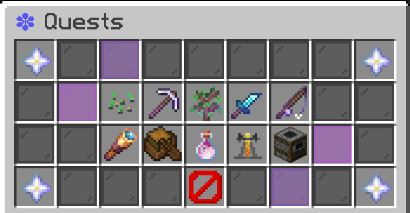

# Contributing to the Wiki

Found something missing, outdated or incorrect? You can help us improve the Wiki by editing it directly on GitHub! This page explains how to get started and make your first contribution.

## Step 1 - Access the wiki repository on GitHub

First, head over to the GitHub website and [create an account or login](https://github.com/) if you haven't yet.

Once you're logged in, you can head over to the Wiki repository at [https://github.com/vibecentralmc/wiki](https://github.com/vibecentralmc/wiki). This official repository page shows all the Wiki's most up-to-date page files and assets that are displayed nicely here on the GitBook frontend.


You can make wiki edits entirely through your browser on GitHub, but if you're an experienced user you can clone the repository and edit the wiki files locally on your PC using your preferred text/markdown editor.


<figure><figcaption></figcaption></figure>

## Step 2 - Create a fork of the repository

A "fork" on GitHub is a personal copy of a repository. Your fork/working copy is where you'll make all your proposed edits to the Wiki.

To make a fork, simply hit the "Fork" button on the top right of the repository (see image above).

Your created fork of the wiki will live at _https://github.com/**`yourname`**/wiki_

<figure><figcaption></figcaption></figure>

You can ensure you're on your fork by looking at the top - note how it says "forked from vibecentralmc/wiki".

### Understanding up to date status

Note the section just under that shows "This branch is up to date". This means that both the official wiki repository and your fork are currently identical. As you or others make changes, this status will update. For example:

* "This branch is 3 commits ahead of vibecentralmc" means you have made and saved three changes to your fork that are not yet in the official wiki.
* "This branch is 1 commit behind vibecentralmc" means the official wiki has one change that your fork doesn't yet have, and you'll need to sync your fork to get it using the "Sync fork" button.

### **Understanding commits**

In version control systems like Git, which are often used for codebases and other collaborative projects like wikis, a 'commit' is essentially a group of one or more edits you made to the project at a specific point in time. You can think of it like saving a document and taking a snapshot of just those changes.

* **On GitHub, when you 'commit' changes,** you're packaging up a set of all your most recent changes since your last commit (like adding a new sentence, fixing a typo, etc.) and giving it a brief name & description of your primary changes, like "Fix typo in rules page" or "Create Skills page".
* **In GitHub, each commit builds on the previous one,** creating a chronological history of all edits to the project. This ensures everything is tracked and can be reverted or referenced if needed. You can explore all the commit history by clicking on "commits" in the top right of the project, and even browse the entire repository as a snapshot when a specific commit was made.

## Step 3 - Make your contributions in your fork

The Wiki pages use markdown formatting, similar to Discord. For example, you can bold text by surrounding it with two asterisk like `**this**` .

A large majority of the markdown that will be helpful to know can be learned at [https://www.markdownguide.org/basic-syntax/](https://www.markdownguide.org/basic-syntax/). But mainly, you should be able to get the gist of it by just looking at pages for reference and comparing their raw markdown vs their rendered previews.


GitBook also uses special formatting and tokens to represent things like hint boxes (the box this text is in). For the most part, you shouldn't worry or bog yourself down about the complex formattings and just focus on the content and accuracy of your contributions. Any special formattings can be added by staff later on - the content itself is what matters the most!


**Now all that's left to do is find what you want to edit or add!**

You can find Table of Contents and quickly navigate to any existing wiki page by opening the SUMMARY.md file which is at the bottom of the repository page in the files section (highlighted in red):

<figure><figcaption></figcaption></figure>

<figure><figcaption></figcaption></figure>

Once you open the page you'd like to edit, you'll see something like this. Hit the edit button in the top right (highlighted in red).

<figure><figcaption></figcaption></figure>

You can now freely edit the page's markdown! Swap between "edit" and "preview" at the top left to see the rendered view of the page.

<figure><figcaption></figcaption></figure>

After you've made edits, hit the green "commit changes" button in the top right and explain your changes. This will commit your edits to **your fork only** of the repository.

You can continue editing files like this and creating commits for as long as you please.

## Step 4 - Submit your contributions to be merged into the official Wiki

When you're ready to submit your changes to the official wiki, head back to your fork's main page at _https://github.com/**`yourname`**/wiki_

<figure><figcaption></figcaption></figure>

Click the "Contribute" button, and then "Open Pull Request"&#x20;

<figure><figcaption></figcaption></figure>

<figure><figcaption></figcaption></figure>

None of the options at the top need to be adjusted! Just add a title and write a description of your changes, then hit "Create pull request".

When you create a pull request/PR, you're submitting your changes from your personal working copy / fork of the wiki to be merged or "pulled" into the official, main version.

PRs also serve as dedicated conversation threads. Staff members can reply in your PR to ask questions about your changes or request further edits if needed. If everything looks good, has no conflicts, and meets the wiki's standards, staff will approve your PR! Once approved, all your changes will be merged into the live wiki here within minutes!


We recommend hitting the "Watch" button in your PR to ensure you recieve email notifications for any activity in it.


## Have any questions or need any help with anything?

Just reach out! Using tickets on our [Discord](general/discord.md) are the best way to get into contact with server staff. Your contributions are greatly valued :]
