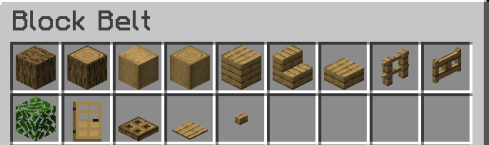

# Creative Plots

The plot world is a communal build space where everybody can get dedicated plots of land to build freely in creative, solo or with friends! Equip with intuitive plot controls and [WorldEdit](../general/misc./worldedit.md) with a 500,000 blocks per operation limit, the plot world is a great place to let your creativity shine. The modes flexibility also makes it an ideal place to prototype builds and designs before making them in the survival world.

Use **`/creative`** to travel to the plot world!

<figure><figcaption>
Plotworld as of Jan 2023
</figcaption></figure>

### Plot manage menu

Plot settings, access management, and other changes can be made through the plot manage menu accessed by right-clicking the diamond in your hotbar. Plot manage actions are executed on the plot you are currently within.

In the menu, you can:

* Add or remove a players permission to build on your plot
* Set plot biome
* Set plot time
* Set plot weather
* Kick/ban a player from the plot
* Find center
* Set plot spawn (where players are teleported when using the /plot visit command)
* See plot info
* Merge/unmerge plots
* Reset plot
* Delete plot

### WorldEdit

WorldEdit is offered in the plot world. For in-depth information and commands, see the [WorldEdit page](../general/misc./worldedit.md).

### Block belts

Using the F key while holding an item will show blocks of similar type for you to easily grab them.

<figure><figcaption>
A belt produced by pressing F while holding oak planks
</figcaption></figure>

### Commands

* **`/plot auto`**\
  Automatically claim and teleport to an available plot\

* **`/plot claim`**\
  Claim the plot you're currently standing in if not taken\

* **`/plot visit [player] [plot number]`**\
  Teleport to somebody's plot
