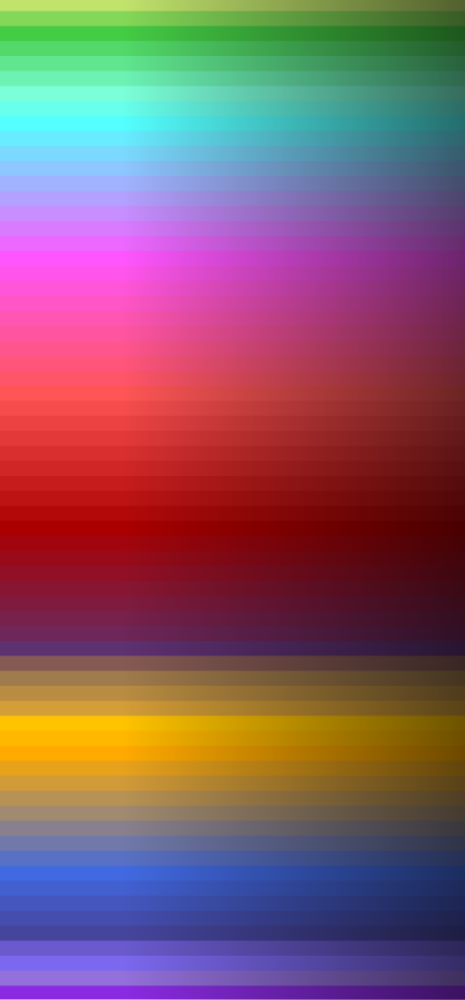
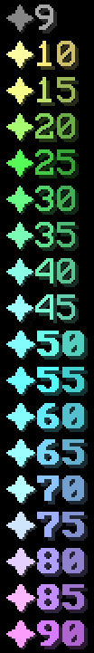
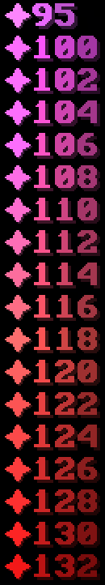
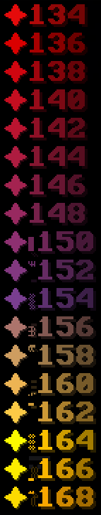
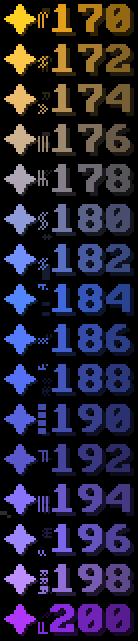

# Leveling

## Ⓔ Vibe Experience

Similar to Minecraft's xp, we have our own experience and leveling system for the server. You'll automatically level up when you earn enough VXP. Earn it being active, doing quests, and generally doing things on the server. Player's server level are shown next to their name in chat, tab, and above their player, prefixed with a star symbol.


Y**our server level is a metric of how experienced & well-known you are around vibe**\
It shows in[ chat](rich-chat/), and above your player in your [nametag](misc./nametags.md)


### Coloring

* Level colors smoothly transition on a gradient. Before the starting yellow color at level 10, level color is gray from 0-9.&#x20;
* Each line in the image below represents +5 levels, and +2 levels after 100, up until level 200.

### Styling

* The level color becomes bolded at and after level 50.
* At level 150 and above, an animated bar (\&k) appears before the level.
* All level colors above level 9 display with their own  gradient from lighter to darker.

<figure><figcaption>
Overview of all level colors 10-200
</figcaption></figure> <figure><figcaption></figcaption></figure> <figure><figcaption></figcaption></figure> <figure><figcaption></figcaption></figure> <figure><figcaption></figcaption></figure>

