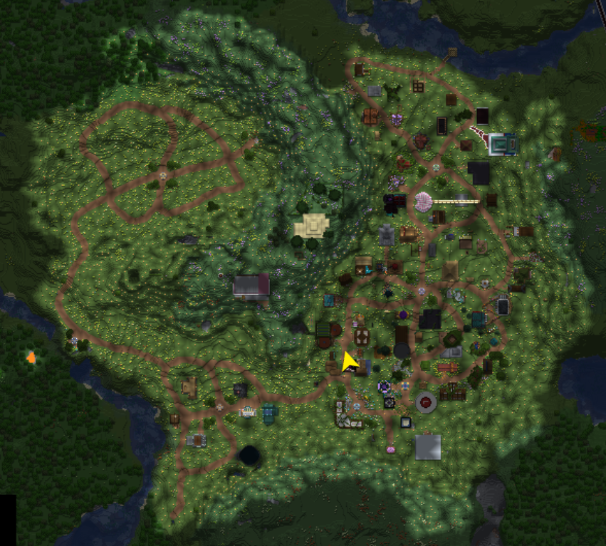

# Leveling

## Ⓔ Vibe Experience

Similar to Minecraft's xp, we have our own experience and leveling system for the server. You'll automatically level up when you earn enough VXP. Earn it being active, doing quests, and generally doing things on the server. Player's server level are shown next to their name in chat, tab, and above their player.


Your server level is a measure of how experienced & well-known you are around vibe. You can use it to help determine the reputability of a player


Level colors smoothly transition on a gradient. Each line in the image below represents 5 levels, and 2 levels after 100. Before the yellow, level color is gray 0-9. The level color becomes bolded at and after level 50.

<figure><figcaption></figcaption></figure>

