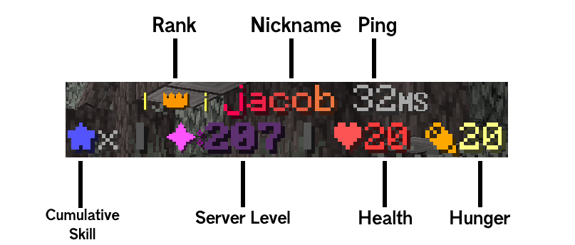

# Nametags

Vibe features customized nametags for players that features Server Rank, Ping, Cumulative skill and such. You can see your own name tag in Third or Second Person.

### Breakdown

<figure><figcaption></figcaption></figure>

* [Ranks](../ranks.md) will be shown in the top left of nametags
* [Nicknames](..//profile-and-customization/nicknames.md) are shown in the top-middle part of nametags
* Your ping will be shown in gray at the top right part of nametags
* Cumulative [skill](../../survival/skill-leveling.md) points are shown with a blue star smiley at the bottom left of nametags
* Your [server level](../leveling.md) will be shown with a star symbol that changes color depending on level at the bottom of nametags
* Health Points are shown with a red heart smiley next to your server level
* Hunger Points are shown with a orange hunger symbol at the bottom right of nametags

A blue "zZz" symbol will appear above a nametag when a player is AFK
