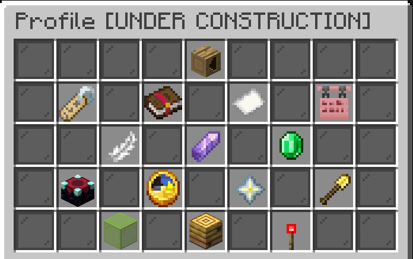

# Profile and customization
This GUI let's you customize how your name and you appear in the server

### **Included options & details**

* Change your [Nickname](nicknames.md)
* Change your [Nametag Decoration](nametag-decorations.md)
* Change your name color
* Change your [join message](joim-messages.md)
* Edit your [Particle Packs](vibe-particle-packs.md)
* Change/Disable your [Glow](glows.md) color

# Your Server Profile
Your server profile can be opened via clicking on your head in **`/profile`**. It shows various statistics and options including in a centralized place for easy management.

* Edit your [nickname](nicknames.md)
* Select your [particle effects](vibe-particle-pack.md)
* Select your [join message](join-messages.md)
* Set your [Nametag Decoration](general/profile-and-customization/nametag-decorations.md)
* View your [claim blocks](../../survival/land-claiming.md#claimable-blocks)
* Toggle [utility flight](../../survival/tweak-list/utility-flight.md)
* Set your [pronouns display](pronoun-display.md)
* View your [vibecoin](../../survival/economy.md) balance
* [Block/entity visualizer](../../survival/tweak-list/block-and-entity-visualizers.md), [extra game sound](../../survival/tweak-list/extra-game-sounds.md), and [biome title](../../survival/tweak-list/biome-titles.md) preferences
* View your [server level](../leveling.md)
* Select your [Glow](general/profile-and-customization/glows.md) Color
* Your [VIP](broken-reference) status
* A help button to report issues to the staff team

