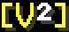
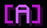

# Ranks


Some of the information and content on this page is outdated. Updates are pending!


## Newcomer

The initial server rank with no special privileges

## Member

Automatically granted to players who have played 8 or more hours (AFK time is excluded)

**Unlocks perks:**

* [Custom nickname (display name)](profile-and-customization/nicknames.md)
* [Join message selection](profile-and-customization/join-messages.md)
* [Community tasks](../survival/community-tasks.md)
* [Reservable nights](../survival/tweak-list/reserved-nights.md)
* [Parkour course](broken-reference/) limit **2 > 8**
* [Creative plot](broken-reference/) limit **4 > 6**
* [Community waypoint](../survival/tweak-list/community-waypoints.md) limit **2 > 8**

## VIP Tiers 1-6

Vibe features six VIP tier ranks with an increasing amount of non pay to win exclusive server perks. Each upgrade is a one time purchase that grants you the lifetime access to the tier. Purchases can be made through our Webstore at [https://site.vibecentral.xyz/vip](https://site.vibecentral.xyz/vip)

Expand

#### VIP Tier 1

**Unlocks perks:**

* **2,000** instant [claimable](../survival/land-claiming.md) blocks increase
* [Personal waypoint](../survival/tweak-list/personal-waypoints.md) limit **5 > 7**
* [Community waypoint](../survival/tweak-list/community-waypoints.md) limit **8 > 10**
* [Parkour course](broken-reference/) limit **8 > 12**
* [Parkour course](broken-reference/) size limit **60x60 > 75x75**
* Access to all [join messages](profile-and-customization/join-messages.md)
* Access to all [nametag decorations](profile-and-customization/nametag-decorations.md)
* Extra[ community tasks](../survival/community-tasks.md) slot for 2 concurrent listings
* Access to VIP [Discord](discord.md) channels
* Sparking diamond next to your name in our [Discord](discord.md)
* Early access to new features
* **`/firework`** _Make a show!_\
  \&#xNAN;**`/trash`** _Open a disposal gui_\
  \
  [Command descriptions](commands.md#vip-exclusive)

#### VIP Tier 2

**Unlocks perks:**

* All previous tier's perks (excluding claim blocks)
* [Personal waypoint](../survival/tweak-list/personal-waypoints.md) limit **7 > 10**
* [Community waypoint](../survival/tweak-list/community-waypoints.md) limit **10 > 12**
* [Parkour course](broken-reference/) limit **12 > 14**
* [Parkour course](broken-reference/) size limit **75x75 > 85x85**
* [Creative plot](../creative-plots/creative-plots.md) limit **6 > 8**
* **`/craft`** _Open & virtual crafting gui_\
  \&#xNAN;**`/clearinventory`**\
  \
  [Command descriptions](commands.md#vip-exclusive)

#### Vip Tier 3

**Unlocks perks:**

* All previous tiers' perks (excluding claim blocks)
* [Personal waypoint](../survival/tweak-list/personal-waypoints.md) limit **10 > 14**
* [Community waypoint](../survival/tweak-list/community-waypoints.md) limit **12 > 14**
* [Parkour course](broken-reference/) limit **14 > 16**
* [Parkour course](broken-reference/) size limit **85x85 > 125x125**
* **Creative plot limit 8 > 10**
* **+.05** survival[ utility fly](../survival/tweak-list/utility-flight.md) speed
* Custom colors for [nametag decorations](profile-and-customization/nametag-decorations.md)
* **`/glow`** _Colored Outline_
* **`/fly`** _Free_ [_utility fly_](../survival/tweak-list/utility-flight.md)_, no xp cost_\\
* \&#xNAN;**`/nightvision`**_Infinite night vision_
* **`/glow`** _Colored Outline_\
  \
  [Command descriptions](commands.md#vip-exclusive)

#### Vip Tier 4

**Unlocks perks:**

* All previous tiers' perks (excluding claim blocks)
* [Personal waypoint](../survival/tweak-list/personal-waypoints.md) limit **14 > 19**
* [Community waypoint](../survival/tweak-list/community-waypoints.md) limit **14 > 16**
* [Parkour course](broken-reference/) limit **16 > 18**
* [Parkour course](broken-reference/) size limit **125x125 > 150x150**
* [Creative plot ](../creative-plots/creative-plots.md)limit **10 > 13**
* **+.10** survival [utility fly](../survival/tweak-list/utility-flight.md) speed
* **5%** less [vibecoin respawn fee](../survival/economy.md)

#### Vip Tier 5

**Unlocks perks:**

* All previous tiers' perks (excluding claim blocks)
* [Personal waypoint](../survival/tweak-list/personal-waypoints.md) limit **19 > 25**
* [Community waypoint](../survival/tweak-list/community-waypoints.md) limit **16 > 18**
* [Parkour course](broken-reference/) limit **18 > 20**
* [Parkour course](broken-reference/) size limit **150x150 > 175x175**
* [Creative plot](../creative-plots/creative-plots.md) limit **13 > 16**
* **+.15** survival [utility fly](../survival/tweak-list/utility-flight.md) speed
* **10%** less [vibecoin respawn fee](../survival/economy.md)
* **`/enderchest`** _Open your enderchest anywhere_
* **`/pp`** _Manage your_ [_Particle Packs_](general/profile-and-customization/vibe-particle-pack.md)\
  \
  [Command descriptions](commands.md#vip-exclusive)

#### Vip Tier 6

**Unlocks perks:**

* All previous tiers' perks (excluding claim blocks)
* [Personal waypoint](../survival/tweak-list/personal-waypoints.md) limit **25 > 32**
* [Community waypoint](../survival/tweak-list/community-waypoints.md) limit **18 > 20**
* [Parkour course](broken-reference/) limit **20 > 30**
* [Parkour course](broken-reference/) size limit **175x175 > 200x200**
* [Creative plot](../creative-plots/creative-plots.md) limit **16 > 20**
* **+.20** survival [utility fly](../survival/tweak-list/utility-flight.md) speed
* **15%** less [vibecoin respawn fee](../survival/economy.md)
* **`/blocks`** _Turn compressible items into blocks_\
  \
  [Command descriptions](commands.md#vip-exclusive)

## Benefactor

Benefactors are folk who have generously donated $100 or more to vibe. The role itself shares same abilities as VIP Tier 6, with the exception of a special prefix. There is a special benefactor hall at the [hub](misc./hub.md) that showcases the benefactors.

<figure><figcaption></figcaption></figure>

## Moderator / Helper

Mods do all the same things as members, but have additional responsibilities designated in surface-level community management to ensure the server stays fun and enjoyable for all, such as muting or jailing rule breakers, and raising issues whether related to the server or specific users to administrators.

While Helper and Moderator refer to the same role in the server, Moderator is the official title. H is used in-game for prefixing, as M is already occupied by Members.

Interested in joining our team? See the [staff application info page](misc./staff-application-info.md)

## Administrator

Admins play a crucial role in the server management, handling tasks like banning rule breakers, rolling back block damage from griefs or robberies, assisting in the rollout of new features or changes to existing server functions by providing feedback and recommendations, maintaining order and direction among lower level staff, as well as managing daily operations to ensure a smoothly functioning server environment.

<figure><figcaption></figcaption></figure>

## Owner

The highest level of management on the server, involving things like development, management of the servers backend architecture, leading ideation and design for new features, financial oversight, and managing other key logistical elements that maintain server operations and determine its direction and structure.

<figure><figcaption></figcaption></figure>

