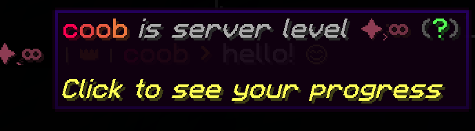
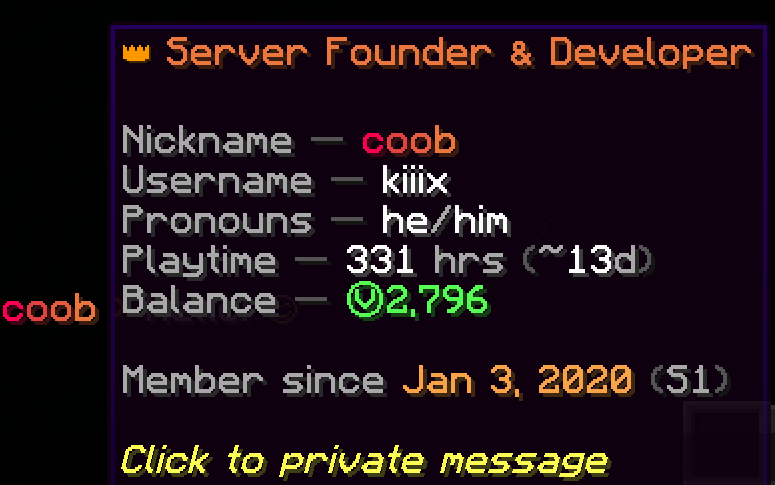
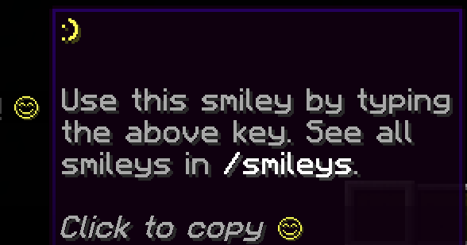

# Chat

Each component of player chat may be hovered or clicked for an upgraded chat experience. A breakdown of what you can see & do is below.

## Chat Message Breakdown

### _This is the message we're using in the example_

<figure><figcaption></figcaption></figure>

### _Hover the letter prefix at the very start of the message to see the dimension it was sent from and the timestamp in EST time_

<figure><figcaption></figcaption></figure>

<table><thead><tr><th width="86.598388671875">Prefix</th><th>Dimension</th></tr></thead><tbody><tr><td>S</td><td>SMP - Overworld</td></tr><tr><td>S-N</td><td>SMP - Nether</td></tr><tr><td>S-E</td><td>SMP - End</td></tr><tr><td>S-R</td><td>SMP - Resource World</td></tr><tr><td>S-M</td><td>SMP - Moon</td></tr><tr><td>C</td><td>Creative Plotworld</td></tr><tr><td>PK</td><td>Parkour Lobby</td></tr><tr><td>PKR</td><td>Parkour Course</td></tr><tr><td>PG</td><td>Party Games</td></tr><tr><td>H</td><td>Hub</td></tr><tr><td>?</td><td>Unknown Dimension</td></tr></tbody></table>

### _Hover the number to the left to see_ [_leveling_](../leveling.md) _details_

<figure><figcaption></figcaption></figure>

### _Hover the rank prefix to see the ranks full name_

<figure><figcaption></figcaption></figure>

### _Hover names to see a mini profile, or click to pm_

<figure><figcaption></figcaption></figure>

### _If the player has a nametag decoration, you can also hover that here to open the menu_

<figure><figcaption></figcaption></figure>

### _Hover & click the actual message text to applaud it_

When you applaud, the sender will see which message you applauded, see heart particles around them, and hear a pling sound. Applauding messages is a great way to easily show non verbal support on a message, whether you found it agreeable, funny, or otherwise deserving of appreciation.

<figure><figcaption></figcaption></figure>

This message also has a [smiley](smileys.md) that we can hover!

<figure><figcaption></figcaption></figure>

## Private Messages

Example section pending

### Commands

Commands section pending
