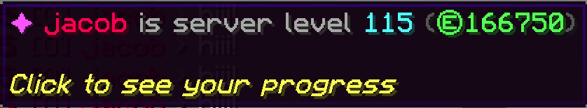
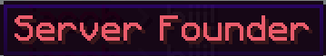
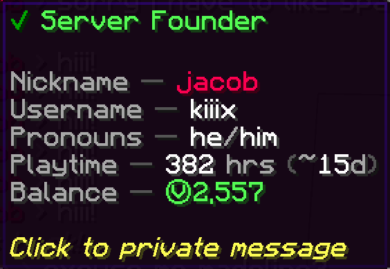

# Rich chat

Each component of player chat may be hovered or clicked for an upgraded chat experience. A breakdown of what you can see & do is below.

## Breakdown

### This is the message we're using in the example

<figure><figcaption></figcaption></figure>

### Hover the number to the left to see [leveling](../leveling.md) details

<figure><figcaption></figcaption></figure>

### Hover the rank prefix to see the ranks full name

<figure><figcaption></figcaption></figure>

### Hover names to see a mini profile, or click to pm

<figure><figcaption></figcaption></figure>

### Hover & click the actual message text to applaud it

When you applaud, the sender will see which message you applauded, see heart particles around them, and hear a pling sound. Applauding messages is a great way to easily show non verbal support on a message, whether you found it agreeable, funny, or otherwise deserving of appreciation.

<figure><figcaption></figcaption></figure>
