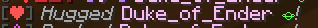
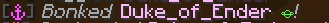
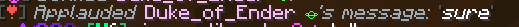
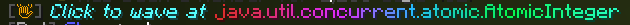

# Hugs, Bonks, Applauds, Waves

We feature commands with visual effects such as `/hug` and `/bonk`, these commands allow players to enrichen interactions.

### Hugs
Want to show some love to a player? You can always hug them! Additionally, our benefactors have access to a `/hug all` command.\
Hugs are visualised with a calm sound effect and heart particles around the player.

### Bonks 
If you do not like a players way of acting you can show it to them by bonking them using `/bonk <player name>` \
Bonks are visualised with an loud sound effect and anger particles around the player.\
 If this player is breaking server rules please report them in the #contact-staff channel in our discord. 

### Applauds
You can show someone that you like, appreciate or agree with their message by applauding the message by clicking on it.\
Applauds are visualised with hearts and white glowing particles around the player.

### Waves
When a player joins the server you will be able to wave at them by either clicking on "Click to wave at [player]" or by running the `/wave <player>` command. You can only wave at a player in a short period of time after they log in.\
Waves are visualised with a private message stating that someone is waving at you.

