# Smileys

We have a huge collection of unicode faces, symbols, and other icons you can use in chat, signs, and anvils called smileys to express yourself in-game! You can view the full collection by category using the **`/smileys`** command.  As of 8/23 and thanks to 1.20's increased unicode support, Smileys has been revamped with actual emoticons and now has a total of 252 unique smileys available!

<figure><figcaption></figcaption></figure>

<figure><figcaption></figcaption></figure>


You can hover a smiley in chat for easy access to it's key. You can also click on it to copy the key to your clipboard!


 Pro tip

You can use "[e]" to stop the server turning messages to smileys! 

<figure><figcaption></figcaption></figure>

## Currently available smileys

Happy

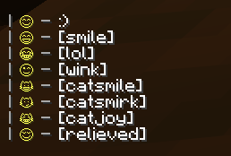<figcaption></figcaption></figure>

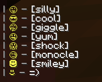<figcaption></figcaption></figure>

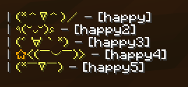<figcaption></figcaption></figure>

Love

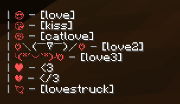<figcaption></figcaption></figure>

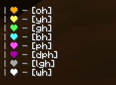<figcaption></figcaption></figure>

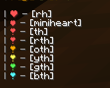<figcaption></figcaption></figure>

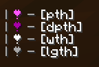<figcaption></figcaption></figure>

Sad

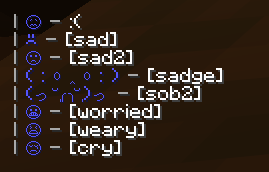<figcaption></figcaption></figure>

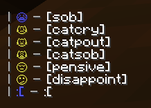<figcaption></figcaption></figure>

Mad

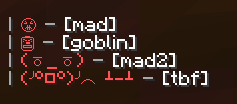<figcaption></figcaption></figure>

Neutral

<figcaption></figcaption></figure>

Misc

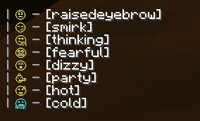<figcaption></figcaption></figure>

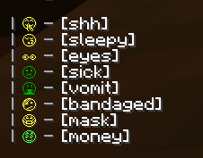<figcaption></figcaption></figure>

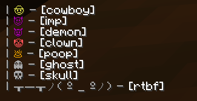<figcaption></figcaption></figure>

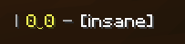<figcaption></figcaption></figure>

Gestures

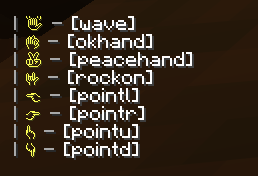<figcaption></figcaption></figure>

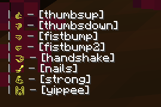<figcaption></figcaption></figure>

Animals

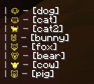<figcaption></figcaption></figure>

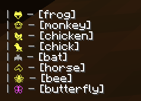<figcaption></figcaption></figure>

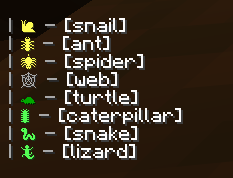<figcaption></figcaption></figure>

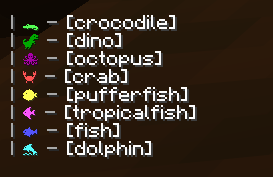<figcaption></figcaption></figure>

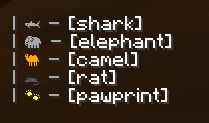<figcaption></figcaption></figure>

Nature

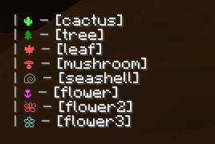<figcaption></figcaption></figure>

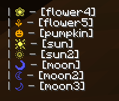<figcaption></figcaption></figure>

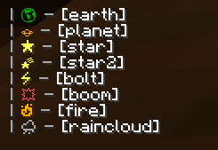<figcaption></figcaption></figure>

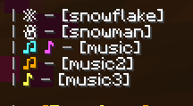<figcaption></figcaption></figure>

Food

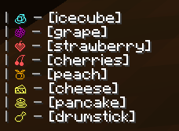<figcaption></figcaption></figure>

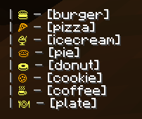<figcaption></figcaption></figure>

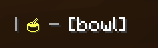<figcaption></figcaption></figure>

Symbols

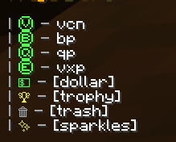<figcaption></figcaption></figure>

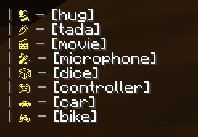<figcaption></figcaption></figure>

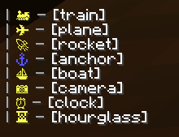<figcaption></figcaption></figure>

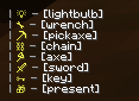<figcaption></figcaption></figure>

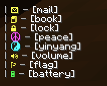<figcaption></figcaption></figure>

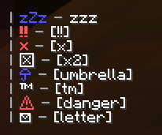<figcaption></figcaption></figure>

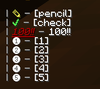<figcaption></figcaption></figure>

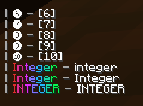<figcaption></figcaption></figure>

The following smileys below do not need brackets to type.

Pride

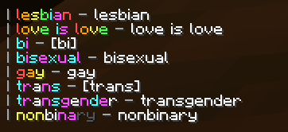<figcaption></figcaption></figure>

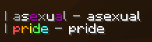<figcaption></figcaption></figure>

