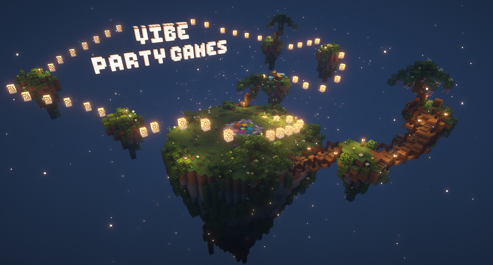

# Party Games

Ever looking for a fun break from survival? We offer a custom-made minigame suite featuring 19 fast paced minigames to play casually any time! The games needs a minimum of 3 players to start, and can hold up to a maximum of 10 players. Each round of party games consists of a random queue of 8 out of the 19 minigames. The system will only repeat already played games when it runs out of unplayed ones, giving each queue a fresh and exciting feel.\
\
Players earn party game points called Stars by placing 1st (+3), 2nd (+2), or 3rd (+1) in minigames. At the end of the queue, the top 3 players with the most Stars win!

<figure><figcaption></figcaption></figure>

### Minigames

There are currently 19 minigames

* TNT Run
    In TNT Run, players are 
* Color Dash
* Memory
* King of the hill
* Minecart racing
* Color Dive
* Spleef
  - In Spleef, your goal is to destroy the blocks below other players, droping them onto different layers until eventually falling into a layer of lava. The last player standing at the end of the round wins!
* Paintball
  - In Paintball, players are put into an arena with the goal of hitting other players with snowballs. Hitting a player gives you a temporary speed boost. The player with the most hits at the end of the round wins!
* Avalanche
* TNT Tag
* Warden Arena
* PVP FFA
* Sumo
* Flower Power
* Diamond Dig
* Delivery!
* Gone Fishin'
* Shooting Range
* The Floor is Lava
