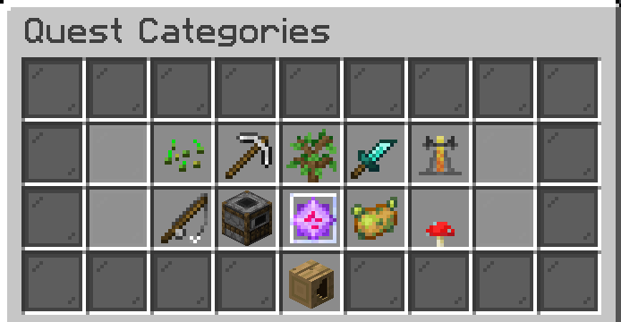

# Questing


**Outdated page**

Some of the information and content on this page is outdated. Updates are pending!


We have tons of custom-made quests in various categories you can do for fun or a challenge. If you ever don't know what to do, quests are a great way to keep occupied!

Each quest can be completely once every 7 days.

### Commands

**`/q`**\
**`/quest`**\
**`/quests`**

## Ⓠ Quest points

Quest points are obtained by doing quests, and contribute to your ranking in the quest leaderboard! You can see the rankings for quest points and total quests completed at the [survival spawn](smp-survival-s8/#spawn) holograms. Each quest gives a different amount of quest points based on difficulty, time taken, etc.

## Available quests

Farming

## Beet That!

**Objectives**\
\- Harvest & replant 1000 beetroots\
\
**Rewards**\
\- 115 vibecoin\
\- 4 quest points\
\- 230 vibe exp

## Potato Plantation

*This quest is sponsored by wingwom™*\
\
**Objectives**\
\- Harvest & replant 2000 potatoes\
\
**Rewards**\
\- 150 vibecoin\
\- 4 quest points\
\- 230 vibe exp

## Cocoa Farming

**Objectives**\
\- Harvest & replant 350 grown cocoa beans\
\
**Rewards**\
\- 85 vibecoin\
\- 2 quest points\
\- 115 vibe exp

## Papers, please!

**Objectives**\
\- Harvest 1500 sugar cane\
\
**Rewards**\
\- 55 vibecoin\
\- 2 quest points\
\- 115 vibe exp

## Berry Crazy

**Objectives**\
\- Harvest 350 sweet berries\
\
**Rewards**\
\- 65 vibecoin\
\- 2 quest points\
\- 115 vibe exp

## Pumpkin Farming

**Objectives**\
\- Harvest 1000 grown pumpkins\
\
**Rewards**\
\- 85 vibecoin\
\- 2 quest points\
\- 230 vibe exp

## Nether Wart Farming

**Objectives**\
\- Harvest & replant 500 nether warts\
\
**Rewards**\
\- 75 vibecoin\
\- 3 quest points\
\- 115 vibe exp

## Prickle Patch Prowl

**Objectives**\
\- Harvest 400 cactus blocks\
\
**Rewards**\
\- 75 vibecoin\
\- 2 quest points\
\- 115 vibe exp

## Carrot Plantation

&#x20;Harvest way too many carrots

**Objectives**\
\- Harvest & replant 4000 grown carrots\
\
**Rewards**\
\- 335 vibecoin\
\- 5 quest points\
\- 345 vibe exp

## SUGAR RUSH!

**Objectives**\
\- Harvest 4000 sugar cane\
\
**Rewards**\
\- 135 vibecoin\
\- 3 quest points\
\- 230 vibe exp

## Melon Farming

**Objectives**\
\- Harvest 1000 grown melons\
\
**Rewards**\
\- 85 vibecoin\
\- 2 quest points\
\- 115 vibe exp

## Bamboo Farming

**Objectives**\
\- Harvest 8500 Bamboo\
\
**Rewards**\
\- 115 vibecoin\
\- 3 quest points\
\- 115 vibe exp

## Glow berry Picking

**Objectives**\
\- Harvest 250 glowberries\
\
**Rewards**\
\- 75 vibecoin\
\- 2 quest points\
\- 115 vibe exp

## This is (s)wheat

**Objectives**\
\- Harvest & replant 2000 wheat\
\
**Rewards**\
\- 150 vibecoin\
\- 4 quest points\
\- 230 vibe exp

Mining

## Quick Trip

Go on a quick trip into a cave!\
Regular ores only, deepslate is not accepted\
\
**Time Limit**\
20 minutes\
\
**Objectives**\
\- Mine 250 stone\
\- Mine 64 coal ore\
\- Mine 64 iron ore\
\
**Rewards**\
\- 65 vibecoin\
\- 1 quest point\
\- 115 vibe exp

## Deep into hell

Head into the nether and mine some of its greatest treasures!\
Recommended to mine at Y-13 using a blast mining method!\
\
**Time Limit**\
2 hours\
\
**Objectives**\
\- Mine 192 nether gold ore\
\- Mine 192 nether quartz ore\
\- Mine 32 ancient debris\
\
**Rewards**\
\- 425 vibecoin\
\- 6 quest points\
\- 500 vibe exp

## Diamond Depths

Venture deep into the world and mine the valuable gems\
\
**Time Limit**\
1 hour 15 minutes\
\
**Objectives**\
\- Mine 32 diamond ore\
\- Mine 32 gold ore\
\- Mine 32 redstone ore\
\- Mine 32 lapis ore\
\- Mine 3 stacks coal ore\
\- Mine 2 stacks iron ore\
\
**Rewards**\
\- 215 vibecoin\
\- 4 quest points\
\- 245 vibe exp

## Gold Rush

Gather nether gold ore quick and earn lots\
Elytra with rockets recommended!\
\
**Time Limit**\
15 minutes\
\
**Objectives**\
\- Mine 215 nether gold ore\
\
**Rewards**\
\- 185 vibecoin\
\- 4 quest points\
\- 230 vibe exp

Environmental

## Lawn Mower Simulator

Geez... the grass is looking a little overgrown. Could you help tidy up some land?\
Made to be completed in a plains biome!\
\
**Time Limit**\
10 minutes\
\
**Objectives**\
\- Mow 1000 grass\
\
**Rewards**\
\- 45 vibecoin\
\- 1 quest point\
\- 115 vibe exp

## Flower Picking: Plains

Stroll about the plains and collect some pretty flowers. Maybe gift them to a friend?\
Must be completed in a plains biome!\
\
**Time Limit**\
30 minutes\
\
**Objectives**\
\- Collect 20 cornflowers\
\- Collect 20 oxeye daisies\
\- Collect 20 azure bluets\
\- Collect 20 dandelions\
\- Collect 20 poppies\
\
**Rewards**\
\- 65 vibecoin\
\- 3 quest points\
\- 115 vibe exp

## Flower Picking: Oak Forest

Stroll about an oak forest and collect some pretty flowers. Maybe gift them to a friend?\
Must be completed in an oak forest!\
\
**Time Limit**\
30 minutes\
\
**Objectives**\
\- Collect 20 lilacs\
\- Collect 20 peonies\
\- Collect 20 rose bushes\
\- Collect 20 poppies\
\- Collect 20 dandelions\
\
**Rewards**\
\- 65 vibecoin\
\- 3 quest points\
\- 115 vibe exp

## Good boys!

There's quite a bit of stray dogs on the server... why not go tame them and give them a safe and loving home? :)\
\
Objectives\
\- Tame 5 wolves\
\
Rewards\
\- 85 vibecoin\
\- 3 quest points\
\- 230 vibe exp

## Honey... ?

Bees. These bad boys produce food for us! They're the only insects that are able to do this. Another fact? Bees will vibrate to warm up their hives when it gets cold! Bees!!\
\
**Objectives**\
\- Harvest honeycombs 20 times\
\- Harvest 20 honey bottles\
\- Breed 8 bees\
\
**Rewards**\
\- 165 vibecoin\
\- 4 quest points\
\- 230 vibe exp

## Dead Bush Cleanup

Must be completed in a desert!\
\
**Time limit**\
10 minutes\
\
**Objectives**\
\- Remove 225 dead bushes\
\
**Rewards**\
\- 50 vibecoin\
\- 2 quest points\
\- 115 vibe exp

## Snow Blower Simulator

Made to be completed in a snowy biome!\
\
**Time Limit**\
5 minutes\
\
**Objectives**\
\- Plow 1000 snow\
\
**Rewards**\
\- 65 vibecoin\
\- 1 quest point\
\- 115 vibe exp

Mob Hunting

## Sniper vs Sniper

Dual skeletons to the death using a bow!\
Recommended to use /resnight\
\
**Time Limit**\
1 hour\
\
**Objectives**\
\- Kill 50 skeletons with a bow\
\
**Rewards**\
\- 175 vibecoin\
\- 4 quest points\
\- 230 vibe exp

## Sonic Boom!

How are these guys so fast?\
\
**Time limit**\
15 minutes\
\
**Objectives**\
\- Kill 25 creepers\
\
**Rewards**\
\- 50 vibecoin\
\- 1 quest point\
\- 115 vibe exp

## Sniper Duels

Minecraft achievement, but harder.\
\
**Time Limit**\
8 minutes\
\
**Objectives**\
\- Shoot and kill 5 skeletons 25+ blocks away using a bow\
\
**Rewards**\
\- 100 vibecoin\
\- 4 quest points\
\- 245 vibe exp

## So the Feast Begins

**Time Limit**\
1 hour\
\
**Objectives**\
\- Hunt 10 cows\
\- Hunt 10 sheep\
\- Hunt 10 pigs\
\- Cook 10 steak\
\- Cook 10 mutton\
\- Cook 10 porkchops\
\- Display one of each on item frames\
\
**Rewards**\
\- 135 vibecoin\
\- 4 quest points\
\- 230 vibe exp

## Undead Management

Traverse the world and hunt down the undead plaguing the community.\
Recommended to use /resnight and start at night\
\
**Time Limit**\
1 hour\
\
**Objectives**\
\- Kill 50 zombies\
\- Kill 50 skeletons\
\- Kill 50 spiders\
\- Traverse at least 2000 blocks\
\
**Rewards**\
\- 165 vibecoin\
\- 4 quest points\
\- 345 vibe exp

## Undead Management 2

Teleport commands will be disabled!\
Traverse the world and hunt down the undead plaguing the community.\
Recommended to use /resnight and start at night\
\
**Time Limit**\
1 hour 30 minutes\
\
**Objectives**\
\- Kill 55 zombies\
\- Kill 55 skeletons\
\- Kill 55 spiders\
\- Kill 55 creepers\
\- Traverse at least 3500 blocks\
\
**Rewards**\
\- 255 vibecoin\
\- 5 quest points\
\- 435 vibe exp

Brewing &#x26; Wizardry

**What's brewin' good lookin'?**\
Potions must be upgraded with glowstone!\
\
**Time Limit**\
1 hour\
\
**Objectives**\
\- Brew 3 swiftness potions\
\- Brew 3 jump boost potions\
\- Brew 3 strength potions\
\- Brew 3 regeneration potions\
\
**Rewards**\
\- 145 vibecoin\
\- 4 quest points\
\- 230 vibe exp

Fishing

## Caught on a line

Go out into the waters and catch some fish!\
Tip: Use luck of the sea & lure for faster completion!\
\
**Objectives**\
\- Catch 8 cod\
\- Catch 4 salmon\
\- Catch 1 pufferfish\
\
**Rewards**\
\- 125 vibecoin\
\- 3 quest points\
\- 115 vibe exp

## 0.8% chance

Reel in the rarest fishing loot- a nametag!\
Tip: Use luck of the sea & lure for faster completion!\
\
Objectives\
\- Reel in a nametag\
\
Rewards\
\- 150 vibecoin\
\- 4 quest points\
\- 230 vibe exp

## Fisherman's delight

A lovely haul from the sea\
Tip: Use luck of the sea & lure for faster completion!\
\
Objectives\
\- Catch 16 cod\
\- Catch 8 salmon\
\- Catch 4 pufferfish\
\
Rewards\
\- 145 vibecoin\
\- 4 quest points\
\- 230 vibe exp

## Finding Nemo

;o;\
Tip: Use luck of the sea & lure for faster completion!\
\
**Objectives**\
\- Catch nemo (tropical fish)\
\
**Rewards**\
\- 85 vibecoin\
\- 4 quest points\
\- 230 vibe exp

Cooking &#x26; Eating

## To Open a Bakery

Seems there's a little baker somewhere in the market!\
Really? Who?\
You!!\
\
**Time Limit**\
30 minutes\
\
**Objectives**\
\- Harvest 109 wheat, 3 eggs, 6 sugar cane, and 2 cocoa beans\
\- Craft 32 bread, 3 cakes, and 16 cookies\
\
**Rewards**\
\- 165 vibecoin\
\- 3 quest points\
\- 230 vibe exp

## Cookie Mayhem

It's cookie time.\
\
**Time Limit**\
30 minutes\
\
**Objectives**\
\- Harvest 12 cocoa beans\
\- Harvest 64 wheat\
\- Craft 4 stacks of cookies\
\
**Rewards**\
\- 65 vibecoin\
\- 2 quest points\
\- 115 vibe exp

## Old fashioned ice cream

Get the job halfway done!\
Must be completed in a snowy biome!\
\
**Time Limit**\
30 minutes\
\
**Objectives**\
\- Milk 5 cows\
\
**Rewards**\
\- 55 vibecoin\
\- 1 quest point\
\- 115 vibe exp

Expert

## Dragon Slayer

Enter the end dimension and summon the Ender Dragon!\
\
**Time Limit**\
5 minutes\
\
**Objectives**\
\- Summon the Ender Dragon by placing 4 end crystals\
\- Kill the Ender Dragon\
\
**Rewards**\
\- 375 vibecoin\
\- 8 quest points\
\- 345 vibe exp

Challenges &#x26; Misc.

## Birds eye

What a view.\
\
**Time Limit**\
5 minutes\
\
**Objectives**\
\- Fly 5000m with an elytra\
\
**Rewards**\
\- 85 vibecoin\
\- 4 quest points\
\- 230 vibe exp

## Via pig

No car? No problem\
\
**Objectives**\
\- Travel 850m on a pig\
\
**Rewards**\
\- 85 vibecoin\
\- 4 quest points\
\- 230 vibe exp

## snzzz

**Objectives**\
\- Sleep through the night 5 times\
\
**Rewards**\
\- 100 vibecoin\
\- 5 quest points\
\- 230 vibe exp

### Extreme Free Falling

&#x20;Teleport commands will be disabled!\
\
**Objectives**\
\- Cumulatively fall 1500m\
\
**Rewards**\
\- 115 vibecoin\
\- 5 quest points\
\- 230 vibe exp

## Business Legend

**Objectives**\
\- Make a trade with villagers 45 times\
\
**Rewards**\
\- 85 vibecoin\
\- 3 quest points\
\- 230 vibe exp

## How far can this go?

&#x20;Travel 100 blocks on every vehicle!\
\
**Time Limit**\
1 hour\
\
**Objectives**\
\- 100m on a boat\
\- 100m on a horse\
\- 100m on a donkey\
\- 100m on a mule\
\- 100m on a minecart\
\- 100m on a pig\
\
**Rewards**\
\- 200 vibecoin\
\- 5 quest points\
\- 230 vibe exp

## Across the ocean!

Ever wonder how a fish feels? No? Okay, sorry.\
Must be completed in any ocean biome!\
\
**Time Limit**\
15 minutes\
\
**Objectives**\
\- Swim 3000 blocks\
\
**Rewards**\
\- 85 vibecoin\
\- 4 quest points\
\- 230 vibe exp

## need sammich FAST

Gather ingredients and make a chicken sandwich\
Prepare in advance!\
\
**Time Limit**\
1 minute\
\
**Objectives**\
\- Harvest 6 wheat\
\- Make two bread\
\- Hunt & cook a chicken\
\
**Rewards**\
\- 75 vibecoin\
\- 4 quest points\
\- 115 vibe exp

Specialty Quests

## Flowers for Kiiix!

Collect kiiix's favorite flowers!\
\
**Time Limit**\
\- 30 minutes\
\
**Objectives**\
\- Collect 35 dandelions\
\- Collect 35 lilacs\
\
**Rewards**\
\- 50 vibecoin\
\- 6 quest points\
\- 230 vibe exp

## Flowers for Olivifrog!

Collect olivifrog's favorite flowers!\
\
**Time Limit**\
30 minutes\
\
**Objectives**\
\- Collect 35 lily of the valleys\
\- Collect 35 cornflowers\
\
**Rewards**\
\- 50 vibecoin\
\- 6 quest points\
\- 230 vibe exp

Daily

### Rewards

* 50 vibecoin
* 5 quest points
* 115 vibe experience

## Blacksmithery

**Objectives**\
\- Repair 8 damaged tools

## Broken Pickaxe

**Objectives**\
\- Break 15 stone blocks with a stick

## Is it hot in here?

**Objectives**\
\- Cumulatively burn for 2 minutes

## Master Bargainer

**Objectives**\
\- Make a trade with 3 different villagers

## Enchanter

**Objectives**\
\- Enchant 15 books

## Explore by foot

**Objectives**\
\- Walk/sprint 2,000 blocks

## Free Falling

**Objectives**\
\- Cumulatively fall 500m

## BOING!

**Objectives**\
\- Jump 200 times

## Skeleton Hunter

**Objectives**\
\- Kill 25 skeletons

## Zombie Hunter

**Objectives**\
\- Kill 25 zombies

## Spider Hunter

**Objectives**\
\- Spider 25 spiders\
&#xNAN;_&#x54;his was initially a typo in the quest description, but we decided to keep it_

## Skeleton Hunter

**Objectives**\
\- Kill 25 skeletons

## Professional Cow Milker

**Objectives**\
\- Milk cows 30 times

## Stone Miner

**Objectives**\
\- Mine 450 stone

## A Good Nights Sleep

**Objectives**\
\- Sleep through a night

