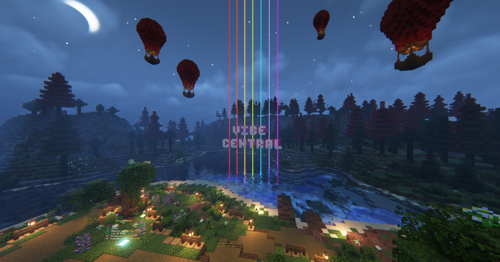
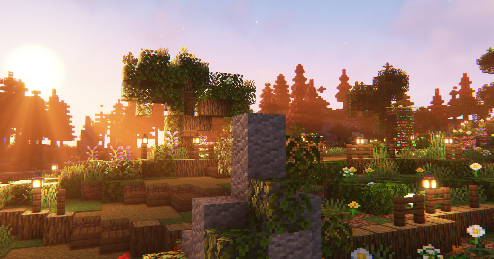
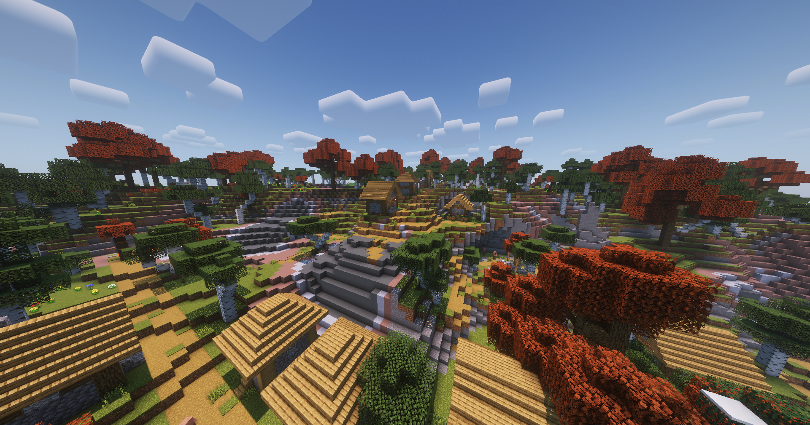
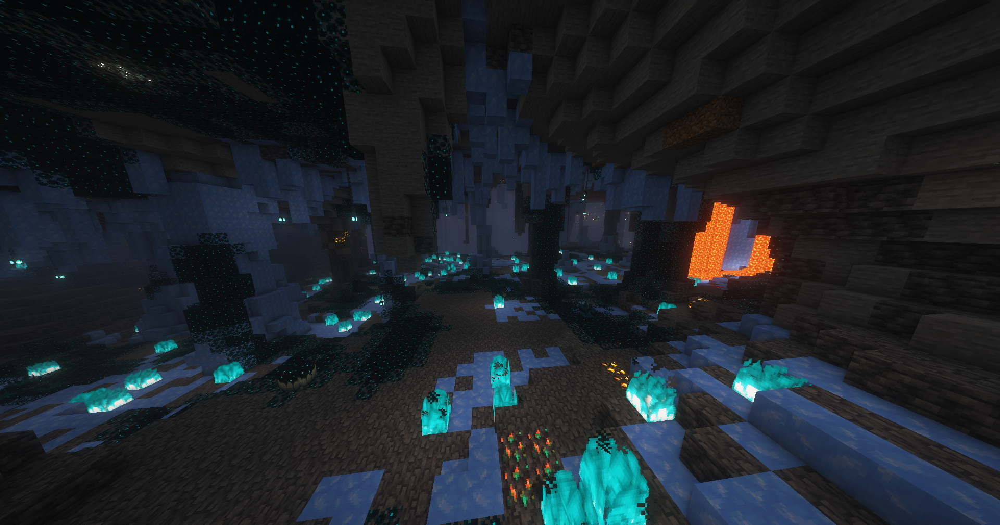
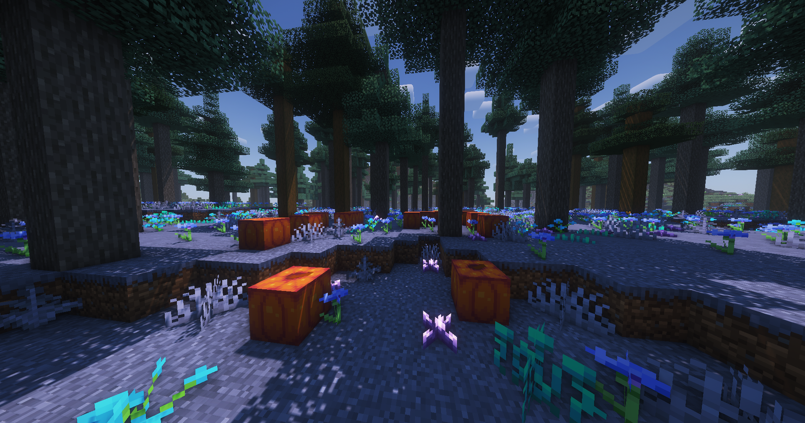

# SMP Survival - S6

Vibe's main attraction; open world, [no-grief](../land-claiming.md) survival with various vanilla-like [tweaks](../tweak-list/), [skills](../skill-leveling.md), [questing](../questing.md), and[ economy](../economy.md) running 1.20.1 with 1.20 generation past 30k blocks from spawn.

### Spawn

You can return to spawn any time using the **`/spawn`** command

<figure><figcaption>
Season 6 survival spawn
</figcaption></figure>

<figure><figcaption></figcaption></figure>

 

<figure><figcaption></figcaption></figure>

 

<figure><figcaption></figcaption></figure>

### Tweaks

Through years of development, we've meticulously fine tuned with immersive enhancements that just feel right. All tweaks expand on the game in a way that stay true to Minecraft's core to create a much more enjoyable, fun, and engaging experience.

Thanks to server & plugin magic, you can join without any special requirements and experience every tweak, no mods or resource packs needed.&#x20;


[tweak-list](../tweak-list/)


### World generation

This season we're excited to offer a world generated with [Terralith](https://www.stardustlabs.net/datapacks#Terralith), adding new world generation throughout over 85 new biomes so you can find the exact perfect place to live. Using all vanilla blocks, the project takes advantage of the games ability to set custom biome colors, adding all new kinds of creative biomes. It's based off vanilla generation and meant to compliment it, adding bigger and better caves, more diversity to generation, and more.

<figure><figcaption></figcaption></figure>

 

<figure><figcaption></figcaption></figure>

 

<figure><figcaption></figcaption></figure>

 

<figure><figcaption></figcaption></figure>

### World size

The world is 35,000 x 35,000 blocks centered around spawn. Chunks past 30,000 blocks in any direction out from spawn are generated on 1.20.1. Chunks inside the 30k radius were generated on 1.19.4.

### Entities & chunks


[entity-de-spawning-and-ai.md](../../technical/entity-de-spawning-and-ai.md)



[chunk-behavior.md](../../technical/chunk-behavior.md)


### Difficulty

The smp runs on the base games normal difficulty, however some tweaks modify the true experienced difficulty, such as mob health and strength adjustments as well as modifications to how hunger works.

### Entering the world

The primary way to enter the world is to random teleport using **`/rtp`**. RTP costs 50 vibecoin per use and can only be done once every 6 minutes. RTP will take you anywhere from 5,000-25,000 blocks from spawn. To significantly decrease the chances players rtp nearby your base, travel past 25k blocks from 547 -2892, as the outer 10k blocks past 25k blocks from spawn are out of RTP radius.


For new players the first RTP will be free of charge.


If you are unable to afford a RTP, you can travel on foot from vibetown or the market. Learn how to [make vibecoin](../economy.md#making-money), and [vote every 24 hours](../../general/misc./voting.md) for 100 vibecoin among other rewards :)

### Season based

The SMP operates on a season based rotation. Based on community retention (roughly every 12 months) we completely refresh the smp, including the overworld, nether, end, economy, inventories, community warps, etc. Our goal is to give sufficient time for everybody to reach end game and feel satisfied with their work, while also ensuring new content is always available for everyone in the future.

New seasons only affect the smp itself. Member or vip ranks, server level, profile information like your nickname, pronouns, preferences, etc. and content in creative plots and parkour are never reset in new seasons.


The smp is currently in its 6th season, which began May 26, 2023



See the [seasons FAQ page](season-information.md) to learn more about seasons

