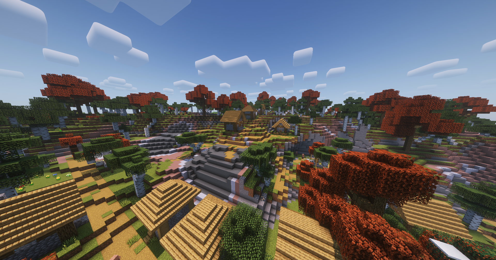
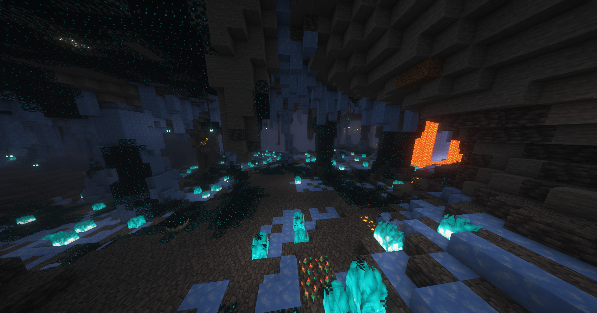
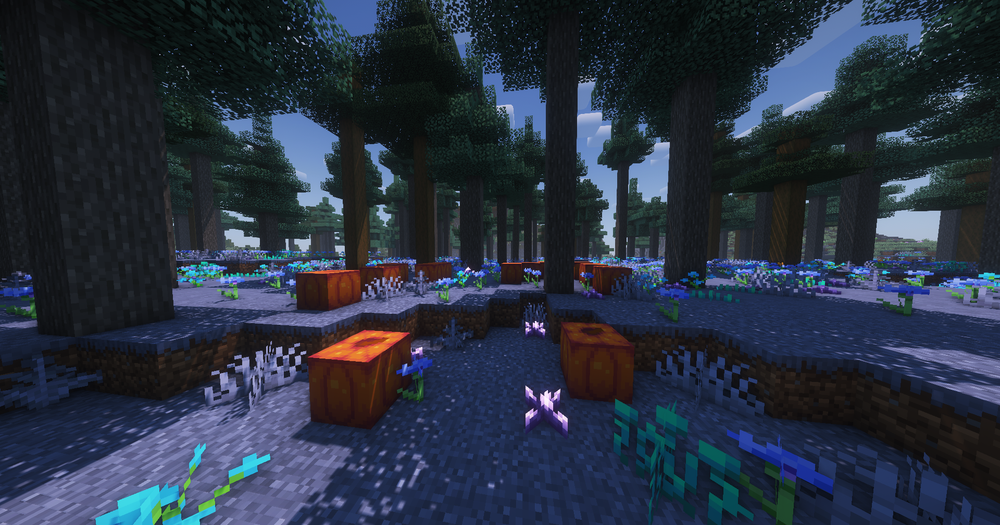

# SMP Survival - S8

Vibe's main attraction: our vast, no-grief SMP world, generated on 1.21.5 featuring custom Terralith + Geophillic generation, [economy](../economy.md), [quests](../questing.md), [skill](../skill-leveling.md) [leveling](../skill-leveling.md), and a multitude of other [enhancements and tweaks ](./#tweaks)that stay true to the Minecraft experience.

### Spawn

You can return to spawn any time using the **`/spawn`** command.

### Tweaks

Through years of development, we've meticulously fine tuned with immersive enhancements that just feel right. All tweaks expand on the game in a way that stay true to Minecraft's core to create a much more enjoyable, fun, and engaging experience.

Thanks to server & plugin magic, you can join without any special requirements and experience every tweak, no mods or resource packs needed.&#x20;


[tweak-list](../tweak-list/)


### World generation

This season we're excited to offer a world generated with a custom version of [Terralith](https://www.stardustlabs.net/datapacks#Terralith) and [Geophillic](https://www.curseforge.com/minecraft/mc-mods/geophilic), adding over 85 new biomes in addition to Vanilla ones. Terralith's new biomes and terrain types, including canyons, shattered biomes, floating islands, volcanos, and 10 new cave types, provide endless exploration opportunities and ensure there is a perfect place for everyone.

Using all vanilla blocks, the project takes advantage of the games ability to set custom biome colors, adding all new kinds of creative biomes, realistic and fantastical.

In addition, [Geophillic](https://www.curseforge.com/minecraft/mc-mods/geophilic) enhances the Vanilla biomes with subtle yet impactful improvements. It adjusts the rarity and density of certain biome features like grass, ferns, and flowers, while adding elements like rocks, fallen trees, moss, tree stumps, a few new tree types, and bushes. These enhancements maintain the essence of Vanilla biomes while subtly updating them with a new depth of natural detail.

<figure><figcaption></figcaption></figure> <figure><figcaption></figcaption></figure> <figure><figcaption></figcaption></figure> <figure><figcaption></figcaption></figure>

### World size

The world is 30,000 x 30,000 blocks out from spawn and holds multiple strongholds.

### Entities & chunks


[entity-de-spawning-and-ai.md](../../technical/entity-de-spawning-and-ai.md)



[chunk-behavior.md](../../technical/chunk-behavior.md)


### Difficulty

The smp runs on the base games normal difficulty, however some tweaks modify the true experienced difficulty, such as mob health and strength adjustments as well as modifications to how hunger works.

### Entering the world

The primary way to enter the world is through [randomized teleportation](../random-teleporting-rtp.md). To significantly decrease the chances players rtp nearby your base, travel past 20k blocks from -1112 2069, as the outer 10k blocks past 20k are out of RTP radius.


For new players the first RTP will be free of charge.


If you are unable to afford a RTP, you can travel on foot from vibetown or the market. Learn how to [make vibecoin](../economy.md#making-money), and [vote every 24 hours](../../general/misc./voting.md) for 50 vibecoin among other rewards :)

### Season based

The SMP operates on a season based rotation. Based on community retention (roughly every 12 months) we completely refresh the smp, including the overworld, nether, end, economy, inventories, community warps, etc. Our goal is to give sufficient time for everybody to reach end game and feel satisfied with their work, while also ensuring new content is always available for everyone in the future.

New seasons only affect the smp itself. Member or vip ranks, server level, profile information like your nickname, pronouns, preferences, etc. and content in creative plots and parkour are never reset in new seasons.


The smp is currently in its 8th season, which began June 13, 2025



See the [seasons FAQ page](season-information.md) to learn more about seasons

