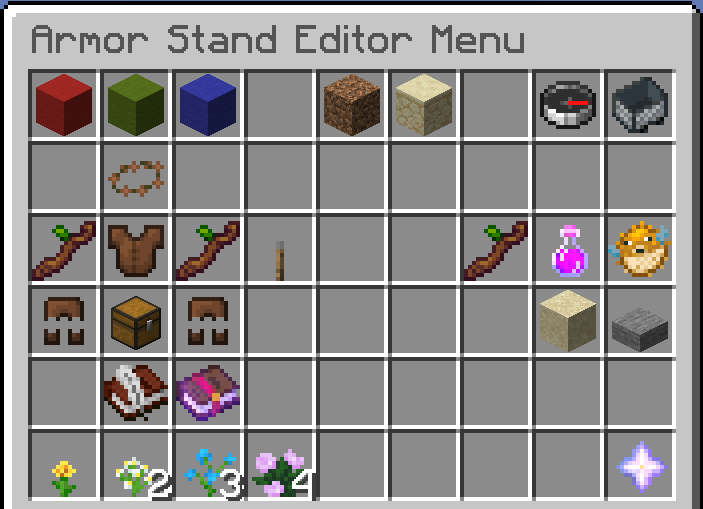

# Armor stand editor

Right click with flint on armor stands to adjust its settings in-depth for full control over its appearance

.png>)


**Pro tip**

You can create floating hologram text by naming the armor stand and making it invisible through the editor!

