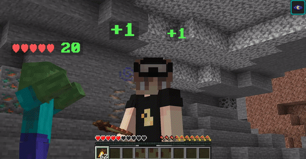
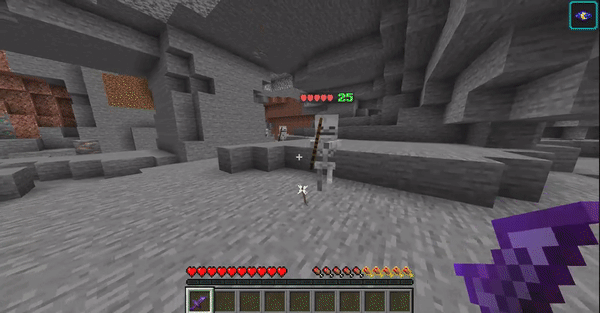
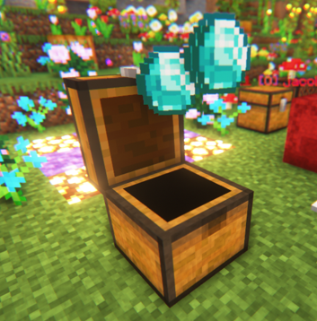
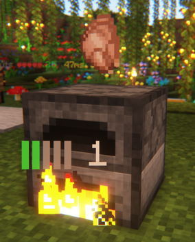
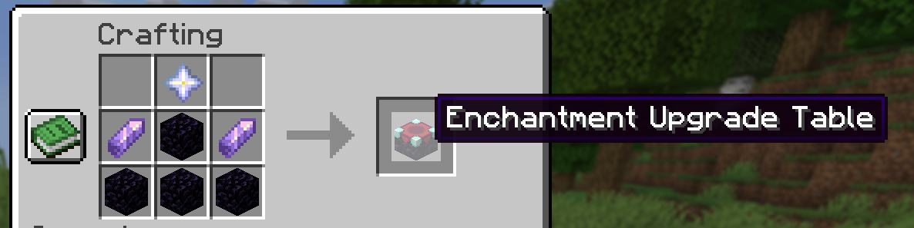
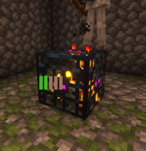

# Block & entity visualizers

Interactable blocks and entities have special visualizers that add an extra level of emersion. If you wish, you can turn most of these visualizers off using the[ profile menu](../../general/profile-and-customization/).

## Visualizers

### Damage indicators & health bars

### Items

Items emit a small glow for visibility 1.5 seconds after dropping. Valuable items will display a white alert particle 10 seconds prior to despawning.

<figure><figcaption>
Stacked items appear with a 3 lined stack icon. Tools appear in italic
</figcaption></figure>

<figure><figcaption>
Valuable items will show a white alert particle 10 seconds prior to despawning
</figcaption></figure>

### Crafting tables

### Chests

### Furnaces & smokers

### Enchantment tables

 

### Jukeboxes

### Anvils

### Lecterns

### Spawners

