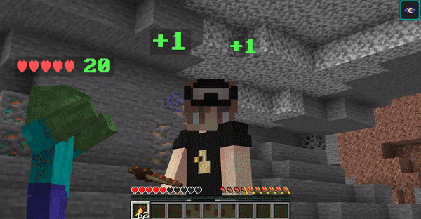
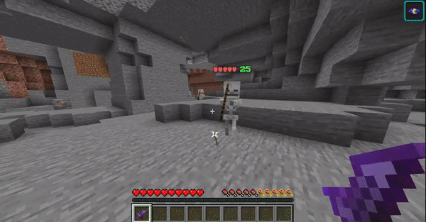
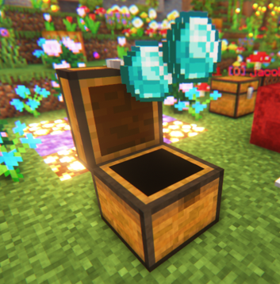
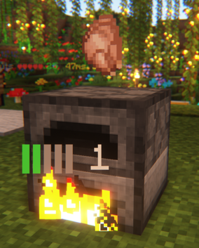
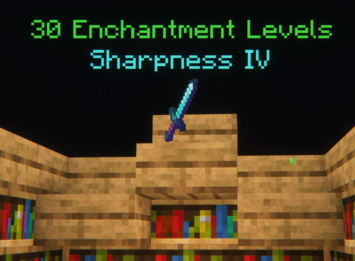
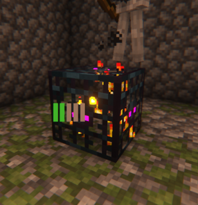

# Block & entity visualizers

Interactable blocks and entities have special visualizers that add an extra level of emersion. If you wish, you can turn most of these visualizers off using the[ profile menu](../../general/profile.md).

## Visualizers

### Damage indicators & health bars

### Crafting table

### Chests

### Furnaces

### Enchantment tables

.png>) 

### Jukeboxes

### Anvils

### Lecterns

### Spawners

