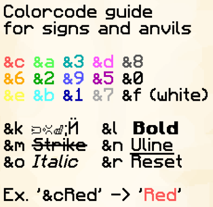

# Color on item names & signs

Signs & item names can be colored using colorcodes in anvils.

Use classic preset colors from the table below, ex. `&cRed` for red text, or for HEX:\
on signs use `&#hexcode`, and in anvils use `&x&`**`0`**`&`**`0`**`&`**`0`**`&`**`0`**`&`**`0`**`&`**`0`**, with each zero representing one character of the hex code, ex. `&x&e&b&4&034Red` for "Red" written in a custom red hex color.&#x20;


You can get this book in-game for quick reference using **`/kit colors`**


