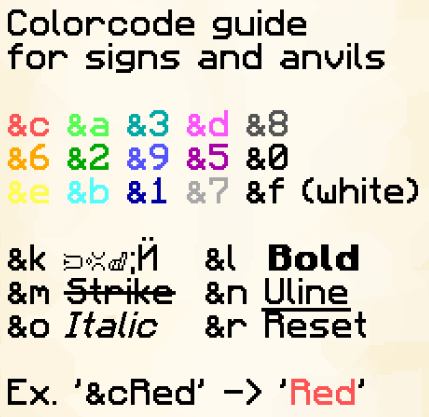

# Color on item names & signs

Signs & item frames can utilize colorcodes and HEX colors directly while typing. For HEX, use `&#hexcode`


You can get this book in-game for quick reference using **`/kit colors`**


