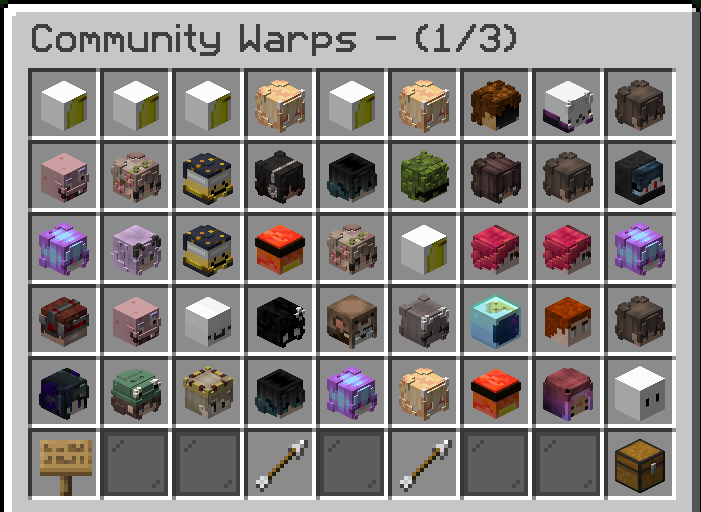

# Community waypoints

Warps let players can create public waypoints to notable locations like towns, shops, community farms, certain biomes, etc. If needed, warp owners can also choose to disable/enable their warps through the GUI for construction or other reasons.

<figure><figcaption></figcaption></figure>

### Commands

* **`/warps`**\
  Open the community made waypoints menu and manage your warps\

* **`/warp <name>`**\
  Teleport to a community waypoint without using the menu\

* **`/setwarp <name>`**\
  Set a new community waypoint at your location\
  &#xNAN;_&#x4C;imited to 8 for_ [_members_](../../general/ranks.md)_, and up to 20 for_ [_VIP_](broken-reference)_s_\

* **`/delwarp <name>`**\
  Delete one of your community waypoints\

* **`/setwarpdesc <warp> <warp description>`**\
  Set the description of a community waypoint
