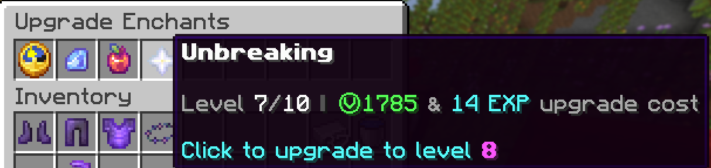

# Enchantment upgrade tables

Enchantment upgrade tables allow you to upgrade your existing enchantments on tools to higher levels past vanilla maxes using vibecoin and xp. Most enchants can be upgraded to level 6, but some range as high as 10. More valuable enchant upgrades such as looting or efficiency cost more vibecoin to upgrade, however xp cost is a flat rate on all upgrades of **`5 * enchant level`**.

Tables are identifiable by their purple particle that emits around the book. Right-click holding the tool you'd like to upgrade to open the table. All tools except crossbows are currently supported by upgrade tables.

Enchantments which have had their vanilla max levels raised are shown on the table below

| Enchantment           | Max level | Vibecoin cost per level |
| --------------------- | :-------: | :---------------------: |
| Efficiency            |     10    |           455           |
| Fortune               |     5     |           515           |
| Looting               |     6     |           425           |
| Protection            |     6     |           255           |
| Blast Protection      |     6     |           195           |
| Projectile Protection |     6     |           175           |
| Fire Protection       |     6     |           195           |
| Thorns                |     6     |           175           |
| Power                 |     8     |           255           |
| Impaling              |     6     |           255           |
| Punch                 |     8     |           175           |
| Knockback             |     6     |           215           |
| Sweeping Edge         |     6     |           175           |
| Lure                  |     8     |           150           |
| Respiration           |     10    |           155           |
| Feather Falling       |     8     |           155           |
| Depth Strider         |     8     |           155           |
| Unbreaking            |     10    |           255           |
| Sharpness             |     10    |           125           |
| Swift Sneak           |     4     |            85           |
| Soul Speed            |     4     |            85           |

.png>)

