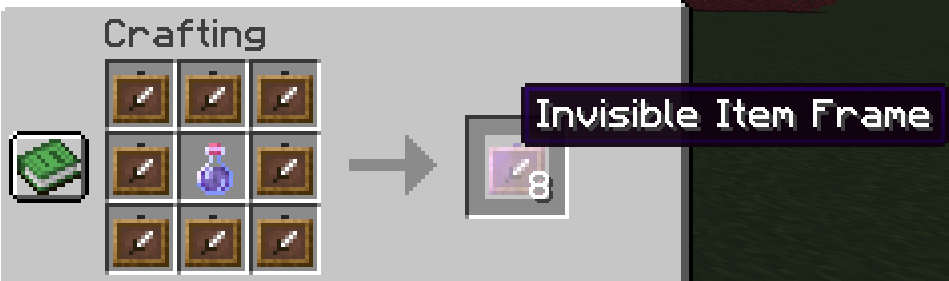

# Invisible item frames

Invisible item frames allow you to place items with no frame for a neat item effect. They can be crafted using 8 regular or glow item frames and a regular potion of invisibility.


**Invisible Glow Item Frames** will illuminate the item in the dark!


 

