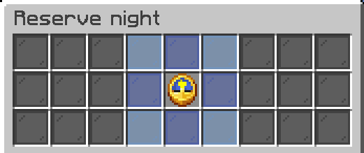

# Reserved nights

Nights can be reserved using credits acquired in the [boosters](../boosters.md) menufor when you need a night to complete certain game tasks or [quests](../questing.md). Reserving night prevents [others skipping it](one-player-sleep.md) by sleeping in a bed. Each player can reserve up to 6 nights every 24 hours.

You may still choose to cut your reserved night short by sleeping


Open the resnight menu using the **`/resnight`** command


