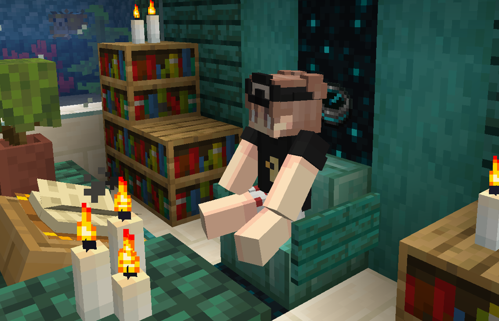

# Sitting, laying, & crawling

You can sit by right clicking stairs, carpets, slabs, snow, and lily pads with an empty hand. You may also sit, lay, or crawl in most other places by using the **`/sit` , `/lay`,** and **`/layflat`** commands.

<figure><figcaption></figcaption></figure>
