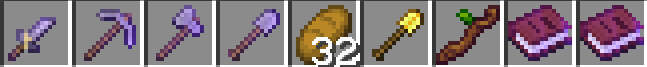

# Starter kit

When you join a season for the first time, you'll get the below starter items.

### Golden shovel & stick


[land-claiming.md](../land-claiming.md)


### Second book


[color-on-item-names-and-signs.md](color-on-item-names-and-signs.md)


### First book

_Newcomer handbook listing useful commands and server information_
