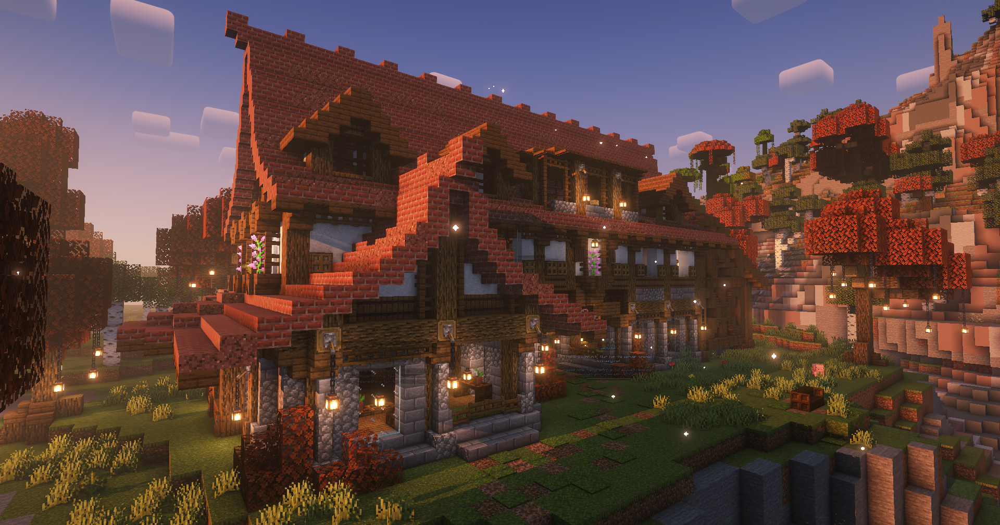

# Vibetown

Vibetown is the servers official town for player housing that’s completely community ran! It's the #1 go to location for those who want to base by others.

When claiming land in Vibetown, players should be mindful of building far enough away from existing builds. And rest assured, like anywhere else on the server, griefing is not permitted. That said, remember to use the shovel from /kit claim to claim your land for extra protection!


**In Season 6, Vibetown is located at (**-864, -1865**)**\
You can go to it by using the **`/warp vibetown`** command


The main vibetown spawn house has beds, community chests, and community supplied enchantment table and [enchantment upgrade table](tweak-list/enchantment-upgrade-tables.md)!

<figure><figcaption></figcaption></figure>
